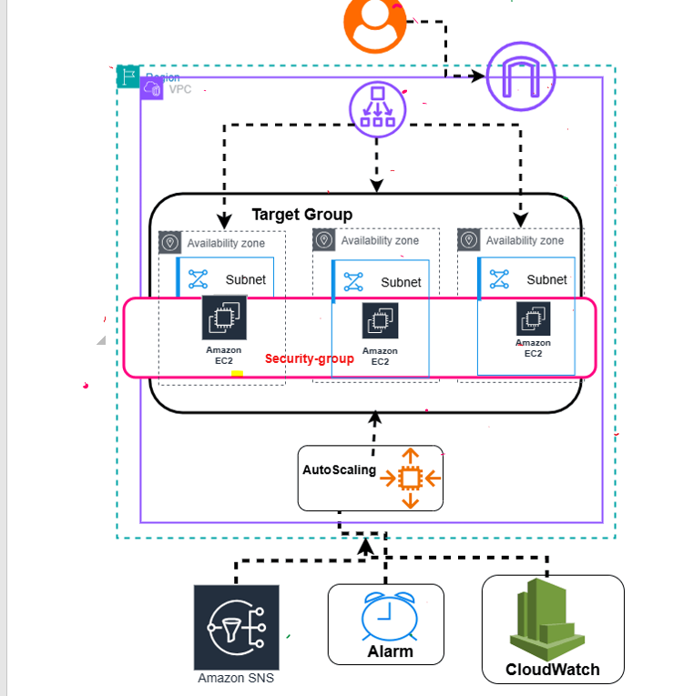

# Highly Available & Auto-Scaling Web Infrastructure on AWS

## Executive Summary
This project delivers a highly available, scalable, and resilient web application infrastructure built using the AWS Management Console. The environment features a custom Virtual Private Cloud (VPC) spanning **3 Availability Zones** with **3 subnets**[cite: 1, 2], an **Application Load Balancer (ALB)**[cite: 1, 2], an **Auto Scaling Group** with dynamic elasticity (1–5 instances)[cite: 1, 2], automated EC2 user data bootstrapping, and proactive monitoring via **CloudWatch Alarms** and **Amazon SNS** notifications[cite: 1, 2].

---

## Business Need vs. Technical Architecture

| Business Requirement | Technical Implementation (AWS Console) |
| :--- | :--- |
| **High Availability (No Downtime)** | Custom **VPC** spanning **3 Subnets** in **3 distinct Availability Zones** behind an **Application Load Balancer (ALB)**[cite: 1, 2]. |
| **Traffic Spike Management** | **Auto Scaling Group (ASG)** dynamically scaling capacity between **1 and 5 EC2 instances**[cite: 1, 2]. |
| **Cost Optimization** | Auto Scaling scale-in rules to terminate unneeded instances during off-peak periods. |
| **Monitoring & Alerting** | **Amazon CloudWatch Alarms** paired with an **Amazon SNS Topic** to deliver real-time notifications for server state changes[cite: 1, 2]. |
| **Scalable Growth** | Automated web server configuration via **Bash User Data scripts** inside an EC2 Launch Template[cite: 1]. |

---

## System Architecture

[cite: 2]

```text
+-----------------------------------------------------------------------------------+
| Amazon VPC                                                                        |
|                                                                                   |
|      [ User / Client ]                                                            |
|             │                                                                     |
|             ▼                                                                     |
|     [ Internet Gateway ]                                                          |
|             │                                                                     |
|             ▼                                                                     |
|   [ Application Load Balancer ]                                                   |
|             │                                                                     |
|             ▼                                                                     |
|  +-----------------------------------------------------------------------------+  |
|  | Target Group                                                                |  |
|  |  +---------------------+  +---------------------+  +---------------------+  |  |
|  |  | Availability Zone 1 |  | Availability Zone 2 |  | Availability Zone 3 |  |  |
|  |  |  +---------------+  |  |  +---------------+  |  |  +---------------+  |  |  |
|  |  |  | Subnet 1       |  |  |  | Subnet 2       |  |  |  | Subnet 3       |  |  |  |
|  |  |  |  +---------+  |  |  |  |  +---------+  |  |  |  |  +---------+  |  |  |  |
|  |  |  |  | EC2 #1  |  |  |  |  |  | EC2 #2  |  |  |  |  |  | EC2 #3  |  |  |  |  |
|  |  |  +--|---------|--+  |  |  +--|---------|--+  |  |  +--|---------|--+  |  |  |
|  |  +-----|---------|-----+  +-----|---------|-----+  +-----|---------|-----+  |  |
|  |        | Security| Group        |         |              |         |        |  |
|  |        +---------+--------------+---------+--------------+---------+        |  |
|  +------------------------------------▲----------------------------------------+  |
|                                       │                                           |
|                                [ Auto Scaling ]                                   |
|                                       ▲                                           |
+---------------------------------------|-------------------------------------------+
                                        │
                               [ CloudWatch Alarm ]
                                        │
                                        ▼
                               [ Amazon SNS Topic ]
```[cite: 2]

### Architectural Components
* **Networking & Ingress:** Internet traffic enters through an **Internet Gateway** attached to the VPC and routes directly to the **Application Load Balancer (ALB)**[cite: 1, 2].
* **High Availability Target Group:** Traffic is balanced across a Target Group consisting of **3 subnets** across **3 Availability Zones**[cite: 1, 2].
* **Instance Security:** A shared **Security Group** controls inbound and outbound access across all **Amazon EC2 instances**[cite: 1, 2].
* **Elastic Capacity:** An **Auto Scaling Group** adjusts instance capacity dynamically (capacity bounds: 1 min, 5 max)[cite: 1, 2].
* **Monitoring & Alerts:** **CloudWatch Alarms** monitor system metrics and trigger **Amazon SNS** notifications when EC2 instances are created, stopped, or terminated[cite: 1, 2].

---

## Step-by-Step Implementation Guide

### Phase 1: Network & Security Setup
1. **Created Custom VPC:** Provisioned a Virtual Private Cloud (VPC) to isolate infrastructure resources[cite: 1].
2. **Configured Subnets:** Created **3 Subnets** distributed across 3 Availability Zones to ensure high availability[cite: 1].
3. **Attached Internet Gateway:** Created an Internet Gateway and attached it directly to the VPC[cite: 1].
4. **Configured Route Table (RT):** Created a custom Route Table, associated all 3 subnets to it, and added a default route (`0.0.0.0/0`) pointing to the Internet Gateway[cite: 1].
5. **Configured Security Group:** Created a unified Security Group within the VPC to manage network access controls[cite: 1].

### Phase 2: Compute Provisioning & Bootstrapping
1. **Provisioned Initial EC2 Instances:** Created **3 EC2 instances** across the 3 subnets/AZs[cite: 1].
2. **Network Credentials:** Assigned the shared Security Group and enabled **Auto-assign Public IP address** for each instance[cite: 1].
3. **User Data Scripting:** Configured the **User Data** section during instance creation to run a Bash bootstrap script that installs and starts the Apache web server (`httpd`) automatically[cite: 1].

### Phase 3: Load Balancing Configuration
1. **Created Target Group:** Configured a Target Group listening on **Port 80** and registered the 3 provisioned EC2 instances[cite: 1].
2. **Provisioned ALB:** Created an Application Load Balancer attached to the Target Group and retrieved the public **ALB DNS Name** for endpoint verification[cite: 1].

### Phase 4: Elasticity & Monitoring Integration
1. **Created Launch Template:** Configured a template containing the EC2 instance configuration, Security Group rules, and User Data script[cite: 1].
2. **Configured Auto Scaling Group (ASG):** Created an Auto Scaling Group attached to the Launch Template spanning all 3 subnets[cite: 1].
3. **Defined Capacity Limits:** Set the Auto Scaling range parameters to **Minimum: 1** and **Maximum: 5** instances[cite: 1].
4. **Health Status Verification:** Checked health checks across the fleet to confirm all instances were healthy[cite: 1].
5. **Configured Amazon SNS:** Established an **Amazon SNS Topic** and subscription to deliver alerts whenever instances are **created**, **stopped**, or **terminated**[cite: 1].

---

## Repository Structure

```text
aws-scalable-web-app/
├── scripts/
│   └── user_data.sh          # Bootstrap script used in EC2 Launch Template
├── website/
│   └── index.html            # Application web page
├── docs/
│   └── architecture-diagram.png  # Visual architecture diagram
├── .gitignore
└── README.md
